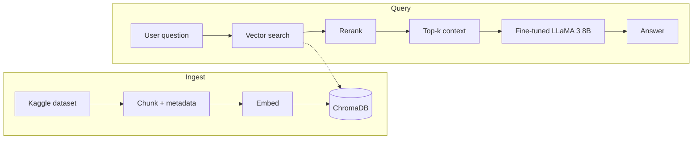

# Information Retrieval — RAG, Rerank & Fine-tuning

## What it is

A **Retrieval-Augmented Generation (RAG)** pipeline for AWS case studies and blogs: you ask a question, the system finds the relevant chunks, reranks them, and a fine-tuned LLaMA 3 8B generates an answer from that context. Built for quality (rerank + domain fine-tune) and clarity (synthetic QA data, eval metrics).

## Pipeline (high level)



- **Ingest:** AWS articles → chunking + metadata → sentence-transformers embeddings → ChromaDB.
- **Query:** Question → similarity search → cross-encoder rerank → top-k chunks → LLM (LoRA on LLaMA 3 8B) → answer.

## What the notebook covers

| Section | What it does |
|--------|----------------|
| **Setup & data loading** | Install deps (transformers, chromadb, sentence_transformers, langchain_community, gradio, etc.), GPU check, download Kaggle dataset (AWS case studies & blogs). |
| **Data preparation** | SpaCy sentence chunking (chunk size 500, overlap 100), metadata (`source`, `topic`: case-study/blog), LangChain `Document` objects. |
| **Embedding & vector store** | Sentence Transformers (`all-MiniLM-L6-v2`), **optional fine-tuning** of the embedding model on the dataset, ChromaDB with metadata; persist DB. |
| **Retrieval & reranking** | Vector similarity search, **cross-encoder reranker** for top-k documents. |
| **Synthetic QA generation** | **Gemini**-based QA pair generation from chunks, data processing & saving, messages template, **push dataset to Hugging Face** ([thinkersloop/aws-case-studies-and-blogs-short](https://huggingface.co/datasets/thinkersloop/aws-case-studies-and-blogs-short)). |
| **Fine-tune LLM** | **Unsloth** + Xformers (Flash Attention), **LoRA** adapters on LLaMA 3 8B (4-bit), load synthetic dataset, train, **save adapter to HF** ([thinkersloop/llama-3-8b-bnb-4bit](https://huggingface.co/thinkersloop/llama-3-8b-bnb-4bit)). |
| **Inference** | Compare base vs fine-tuned model, **Gradio app** for Q&A. |
| **Evaluation** | **Retrieval performance** (top-k relevance), **inference time**, **throughput (QPS)**, **GPU utilization**, **ROUGE scores** for generated answers. |
| **Deployment** | Notes on **high-speed inference** (serving, model optimization, distributed/parallel, caching, monitoring), **VLLM** (merge to 16-bit/4-bit, LoRA adapters). |
| **Conclusion** | Summary of work, potential improvements. |

## What's inside (tech stack)

- **Chunking**: SpaCy (`en_core_web_sm`), sentence-based chunks with metadata.
- **Vector store**: ChromaDB with metadata (scalable to pgvector).
- **Embeddings**: Sentence Transformers (`all-MiniLM-L6-v2`); optional fine-tuning on the dataset.
- **Retrieval**: Similarity search + cross-encoder rerank.
- **Synthetic QA**: Gemini for QA generation; dataset on [Hugging Face](https://huggingface.co/datasets/thinkersloop/aws-case-studies-and-blogs-short).
- **Fine-tuned LLM**: Unsloth, LoRA on [LLaMA 3 8B (4-bit)](https://huggingface.co/thinkersloop/llama-3-8b-bnb-4bit); adapter on HF.
- **Eval**: Retrieval metrics, inference time, QPS, GPU utilization, ROUGE.
- **UI**: Gradio app for Q&A.
- **Deployment**: VLLM, merge options (16-bit / 4-bit / LoRA-only).

## Dataset

[AWS Case Studies and Blogs](https://www.kaggle.com/datasets/harshsinghal/aws-case-studies-and-blogs) (Kaggle). Set `KAGGLE_KEY` and `KAGGLE_USERNAME` (e.g. in Colab secrets) before running.

## How to run

**Recommended:** Open the notebook in Colab (GPU recommended):

[](https://colab.research.google.com/github/lucky-verma/information-retrieval/blob/main/aws-rag-pipeline.ipynb)

**Local:** Install deps and run the notebook (GPU recommended for fine-tuning):

```bash
pip install -r requirements.txt
```

## Repo structure

| Path | Description |
|------|-------------|
| `aws-rag-pipeline.ipynb` | Main notebook: data → embeddings → retrieval → rerank → fine-tune → eval |
| `promblem-statement.md` | Task description and references |
| `requirements.txt` | Python dependencies for local run |

## License

MIT — see [LICENSE](LICENSE).
